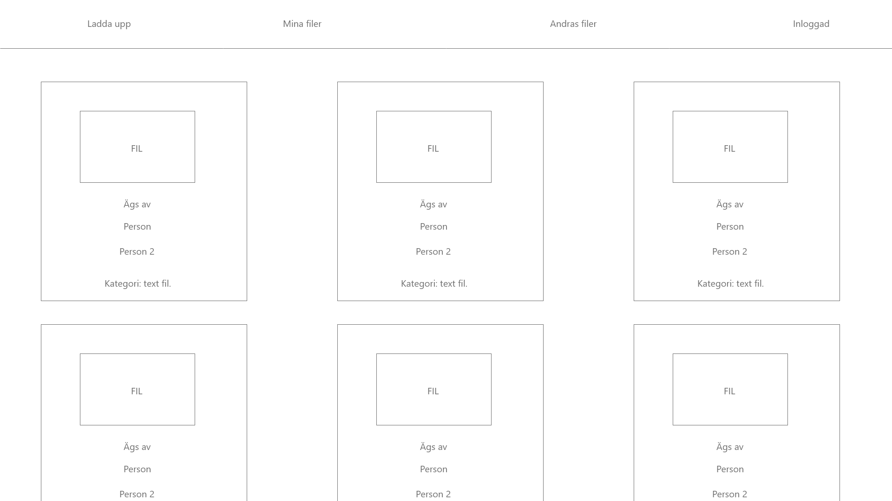
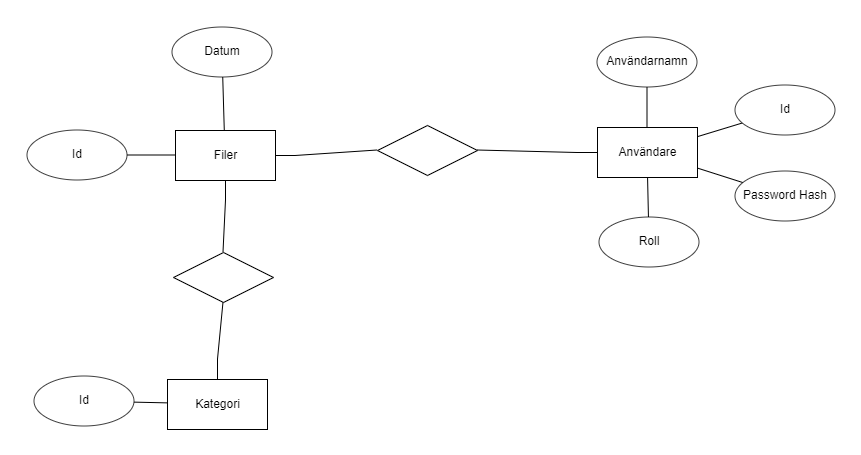

# Projektplan

## 1. Projektbeskrivning (Beskriv vad sidan ska kunna göra)
Filhanterar där flera personer kan äga samma fil, dessa viler kan läsas raderas kategoriseras och skapas
## 2. Vyer (visa bildskisser på dina sidor)
Första sketch på ett ungefär hur de ska se ut med de nödvädigaste funktionerna

## 3. Databas med ER-diagram (Bild)

## 4. Arkitektur (Beskriv filer och mappar - vad gör/inehåller de?)
Använd restful routes

| **URL** | **HTTP Verb** |  **Action**|
|------------|-------------|------------|
| /photos/         | GET       | index  
| /photos/new      | GET       | new   
| /photos          | POST      | create   
| /photos/:id      | GET       | show       
| /photos/:id/edit | GET       | edit       
| /photos/:id      | PATCH/PUT | update    
| /photos/:id      | DELETE    | destroy