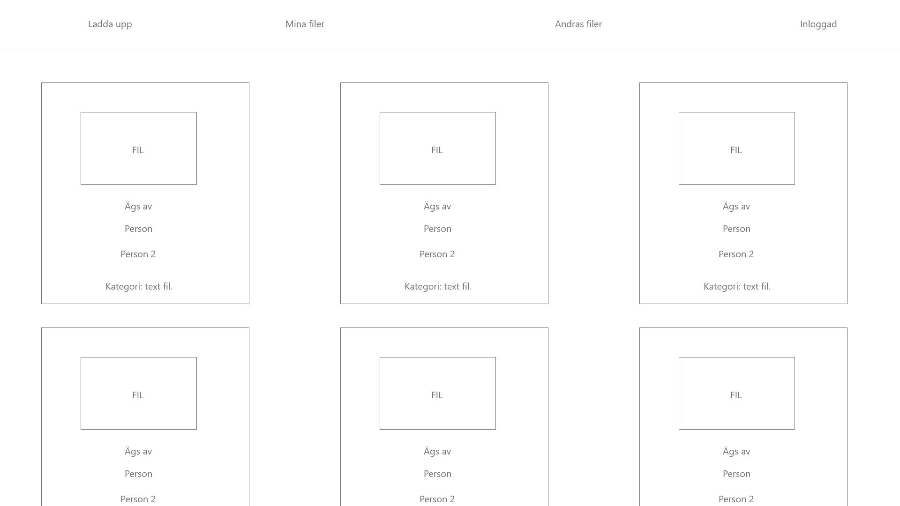
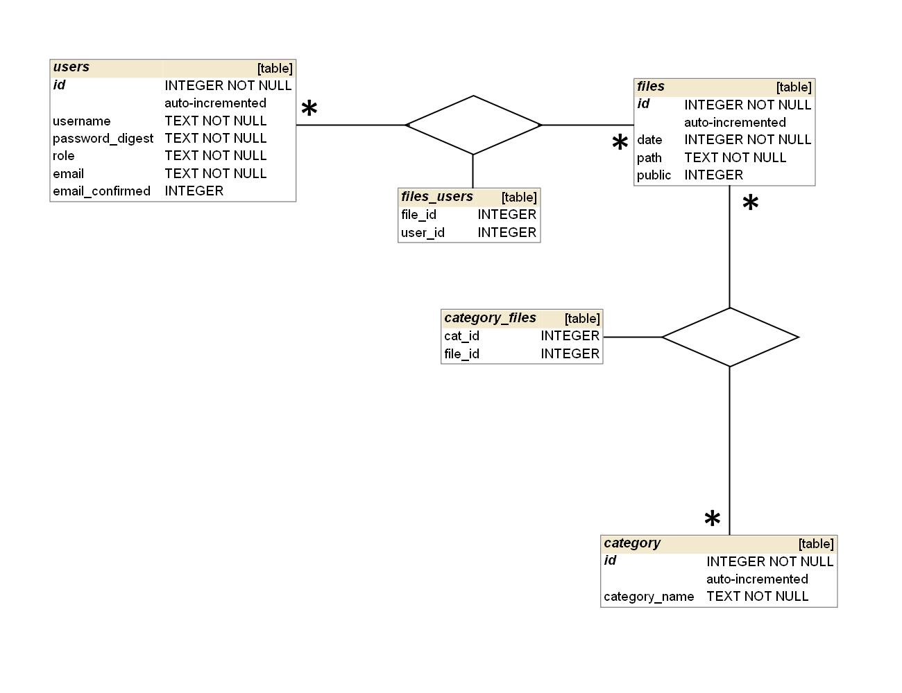

# Projektplan

## 1. Projektbeskrivning (Beskriv vad sidan ska kunna göra)
Molnlagringstjänst där flera personer kan äga samma fil, dessa filer kan läsas, raderas kategoriseras och skapas.
## 2. Vyer (visa bildskisser på dina sidor)
Första sketch på ett ungefär hur de ska se ut med de nödvändigaste funktionerna. Det blev inte riktigt så här eftersom jag inte gjorde tillräckligt med CSS men allt som krävs för att kunna visa det så här är på plats.

## 3. Databas med ER-diagram (Bild)

## 4. Arkitektur (Beskriv filer och mappar - vad gör/innehåller de?)
Private mappen innehåller privata filer. Public/files innehåller publika filer.
model.rb innehåller alla förfrågningar till databasen. app.rb innehåller alla routes och liknande.

Använder restful routes
| **URL**                  | **HTTP Verb** | **Action** |
|--------------------------|---------------|------------|
| /files/show              | GET           | index      |
| /files/:file_id/edit     | GET           | edit       |
| /user/confirm_email/:key | GET           | edit       |
| /files/create            | POST          | create     |
| /files/delete            | POST          | destroy    |
| /categories/delete       | POST          | destroy    |
| /categories/add          | POST          | edit       |
| /user/delete             | POST          | destroy    |
| /user/add                | POST          | edit       |
| /user/resend_email       | POST          | create     |
| /user/register           | POST          | create     |
| /user/login              | POST          | index      |
| /user/logout             | POST          | index      |

<!-- unsure about login and logout -->